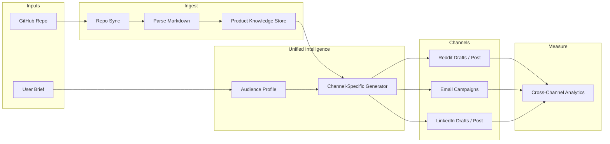

# Unified Outreach Automation from Repo — Plan

> **Purpose:** Single reference for the "unified intelligence layer" (repo → multi-channel outreach). Use with **superpowers:executing-plans** or **superpowers:subagent-driven-development** for the implementation slice (Appendix).

---

## How this plan was created / which agents

- **Source:** This plan was built from conversation and from the Cursor plan file (unified outreach automation). It was not generated by a single automated agent.
- **Skills/plugins you have that apply when implementing:**
  - **superpowers:writing-plans** — Use when creating or refining implementation plans (bite-sized tasks, exact paths, test-first). Save execution-ready plans to `docs/plans/YYYY-MM-DD-<feature-name>.md`.
  - **superpowers:executing-plans** — Use in a separate session to execute a saved plan task-by-task with checkpoints. Run in a worktree; batch tasks (e.g. first 3), report, then continue.
  - **superpowers:subagent-driven-development** — Use in the same session to run one subagent per task with review between tasks.
- **To improve this plan with Claude:** Run Claude over this file and ask it to tighten, add missing steps, or expand sections; reference **superpowers:writing-plans** for task granularity and structure.

---

## 1. Use case elaboration

### The problem you're solving

New startups spend weeks not on building, but on:

- Writing the same story in different tones for Reddit, email, LinkedIn, Twitter, etc.
- Switching between GMass, SalesRobot, Reddit, Notion, and spreadsheets.
- Re-explaining the product every time and keeping messaging consistent.
- Not knowing what actually moved the needle across channels.

### The product

A single place where you:

1. **Connect your repo** (GitHub; later GitLab/Bitbucket).
2. **Feed it your product** via README, `/docs`, CHANGELOG, and any markdown you point it at—plus a short brief from you (audience, tone, goals).
3. **Get one "brain"** that understands the product and your audience.
4. **Run channel-specific outreach** from that brain: subreddit posts, cold emails, LinkedIn posts—generated, scheduled, and (where possible) measured in one dashboard.

### Why "unified intelligence" matters

- **Single source of truth:** Repo + your brief. No copying from Notion to email to Reddit.
- **Channel-aware generation:** Same product, different format—Reddit casual and specific, LinkedIn professional and hooky, email short and CTA-driven.
- **Orchestration over pipes:** The value is the layer that decides what to say, where, and when. Individual channels (APIs, GMass, etc.) are commodity pipes.

---

## 2. Why repo connectability is critical

### Product truth lives in the repo

- **README:** value prop, features, install, "why this exists."
- **/docs:** deeper positioning, use cases, integration notes.
- **CHANGELOG / release notes:** what's new, proof of momentum.
- **CONTRIBUTING / CODE_OF_CONDUCT:** tone and community.

Pulling from the repo means:

- **No stale copy:** Re-sync before a campaign; messaging stays aligned with the product.
- **Less manual writing:** The system drafts from real structure (features, CLI flags, APIs), not from memory.
- **Differentiation:** Tools that only take "paste your blurb" don't scale; "connected to repo" is a clear, defensible wedge.

### Feasibility of repo connectivity

- **GitHub:** `GET /repos/{owner}/{repo}/readme` and `GET /repos/{owner}/{repo}/contents/{path}` return base64 content. Public repos need no auth; private repos need a token with `contents` (and optionally `repo`). Well-documented, rate limits are generous with auth.
- **Scope:** Start with GitHub only. Add GitLab/Bitbucket later via similar contents APIs.

---

## 3. Feasibility by channel

| Channel           | Feasibility | Notes |
|-------------------|-------------|--------|
| **Repo (GitHub)** | High        | REST API for README + contents; optional auth for private repos. |
| **Reddit**        | Medium      | OAuth 2.0; ~60 req/min. Posting allowed; strict ToS and anti-spam—subreddit rules and account age matter. Best as "drafts + manual post" or careful automation. |
| **Email**         | High        | No single "email API"—use SendGrid/Mailgun/Resend for sending, or integrate GMass/Apollo via their APIs if available. Your layer generates copy and (optionally) list inputs; sending is a pipe. |
| **LinkedIn**      | Medium      | Official Posts API; OAuth; requires app verification (1–2 weeks). Scopes: `w_member_social` (personal), `w_organization_social` (company). Best as "generate + suggest" or approved automation. |

### Realistic stance

- **Repo:** Fully automatable (read + periodic sync).
- **Email:** Automatable end-to-end if you use a sending provider and store lists in your app (or CSV upload).
- **Reddit:** Automatable technically; in practice, better to generate drafts and let the user post (or one-click post) to avoid bans and respect subreddit rules.
- **LinkedIn:** Same as Reddit—generate and optionally post via API after verification; "draft in our UI, copy to LinkedIn" is a safe MVP.

---

## 4. Realistic pipeline (architecture)



### Step-by-step pipeline

1. **Connect repo**
   - User links GitHub (OAuth or PAT).
   - You list repos; user picks one (and optionally a branch and paths, e.g. `docs/`, root only).

2. **Sync and parse**
   - Fetch README + selected paths via Contents API; decode base64.
   - Parse markdown (headings, lists, code blocks) into structured chunks.
   - Store in a "product knowledge" store (vector store optional later; for MVP a single blob + sections is enough).

3. **User brief**
   - Form: who's the audience, tone (casual/professional), key differentiators, any "don't say X," launch or campaign goal.
   - Optional: paste a list of subreddits, email segments, or "LinkedIn only."
   - **Discovery (Phase 2+):** "Suggest subreddits" from repo + brief (§ 8); "Suggest personas" and find leads for email/LinkedIn via Apollo or upload (§ 9).

4. **Unified intelligence**
   - Build a minimal "audience profile" from the brief.
   - For each channel, prompt an LLM with: product chunks + audience + channel rules (e.g. Reddit: no heavy marketing, be helpful; LinkedIn: hook + proof + CTA; email: subject + 2–3 lines + CTA).
   - Output: structured drafts (title + body, subject + body, post text + optional image).

5. **Channel execution**
   - **Reddit:** Show drafts per subreddit; "Edit / Post" or "Copy." Optional: post via Reddit API with user's OAuth (rate-limited, use sparingly).
   - **Email:** User uploads list (or connects ESP); you fill subject/body from draft; send via your sending provider (or "export for GMass").
   - **LinkedIn:** Show drafts; "Copy to LinkedIn" or, after app approval, "Post" via API.

6. **Measure**
   - MVP: manual—user marks "used this draft" or "posted here"; optional link tracking for email.
   - Later: ingest Reddit (upvotes/comments via API), email (opens/clicks from provider), LinkedIn (insights if available) into one dashboard.

---

## 5. Suggested implementation phases

**Phase 1 – Repo-to-brain (MVP of the "unified" value)**

- GitHub OAuth or PAT; fetch README + one folder (e.g. `docs`).
- Parse markdown into sections; store in DB or in-memory.
- Simple form: audience + tone.
- One output: "Generate a Reddit post" or "Generate a cold email" from repo + form.
- No posting yet—copy/download only.

**Phase 2 – Multi-channel generation**

- Same repo + brief; generate Reddit, email, and LinkedIn drafts in one run.
- **Subreddit discovery:** Use product + brief to suggest where to post (see § 8).
- Channel-specific prompts and templates.
- UI: list of drafts per channel with edit/copy.

**Phase 3 – Execution**

- Reddit: optional "Post" with OAuth and rate-limit handling; default = draft + copy.
- Email: integrate one sending provider (e.g. Resend/SendGrid); upload list or paste addresses; send from drafts.
- LinkedIn: draft first; optional "Post" after app verification.

**Phase 4 – Measurement and iteration**

- Track which drafts were used/posted; optional link params for email.
- Simple dashboard: "This week: 3 Reddit, 1 email campaign, 2 LinkedIn."
- Later: pull Reddit stats, email opens/clicks, LinkedIn insights into one view.

---

## 6. Risks and mitigations

- **Reddit/LinkedIn ToS and bans:** Prefer "generate + human posts" for MVP; automate posting only with clear disclaimers and rate limits.
- **Spam perception:** Position as "draft from your repo" and "one campaign at a time"; avoid blasting many subreddits or huge lists.
- **Repo private / permission:** Support PAT with minimal scope; explain "we only read markdown, not code."
- **LLM quality:** Use structured prompts per channel and allow heavy editing; treat outputs as drafts, not final copy.

---

## 7. What to build first (recommendation)

1. **Repo connector:** GitHub auth, choose repo, fetch README + `docs` (or configurable path), parse and store.
2. **Brief form:** Audience, tone, one "campaign goal" field.
3. **Single-channel generator:** e.g. "Generate 3 Reddit post drafts" from repo + brief, with subreddit-aware prompts.
4. **Simple UI:** Connect repo → fill brief → see drafts → copy.

That delivers "unified intelligence from your repo" without touching posting APIs. Adding email/LinkedIn generation and then execution keeps the pipeline realistic and shippable.

---

## 8. Finding the right subreddits

**Goal:** From repo + brief, suggest a shortlist of subreddits where posts are likely relevant and allowed (not just "any big sub").

### Ways to do it

**1. Reddit API search (best for automation)**

- Reddit's API supports **subreddit search by query**: e.g. `GET /subreddits/search?q=developer+tools` (or via PRAW: `reddit.subreddits.search("developer tools", limit=100)`).
- Search uses **subreddit title and description**, not posts.
- Response includes: `display_name`, `public_description`, `subscribers`, `over18`, `created_utc`.
- **Pipeline:** From product knowledge + brief, derive 3–5 **keywords** (e.g. "CLI", "open source", "dev tools", "SaaS"). For each keyword (or combined query), call subreddit search; merge and **dedupe**; **rank** by subscribers and relevance (e.g. filter out tiny or NSFW); return top 10–20 with descriptions so the user (or an LLM) can drop bad fits.

**2. LLM suggestion from product + brief**

- No API call: prompt an LLM with "Product: … Audience: … Suggest 10–15 specific subreddits (names only) where a helpful, non-spammy post would fit. Explain in one line per sub."
- Pros: can use nuance (e.g. "r/startups but not r/SaaS"). Cons: may hallucinate subreddit names; **validate** names via Reddit API (`GET /r/{name}/about`) and drop invalid ones.

**3. Hybrid (recommended)**

- Use **LLM** to turn repo + brief into **search queries** (e.g. "developer tools", "founder tools", "open source CLI").
- Run **Reddit subreddit search** for each query; merge, rank, filter (size, SFW).
- Optionally pass the list to the **LLM** again: "Given this product, which of these subreddits are best and why?" to get an ordered shortlist with one-line rationale.
- **Output:** Curated list of subreddits; then Phase 2 "generate drafts" runs **per subreddit** with name + rules (if we fetch sidebar/rules via API) so each draft fits the community.

### Old Reddit vs API for subreddit data

- **Subreddit description:** The **official Reddit API** already exposes `description`, `public_description`, and **rules** (via the Subreddit model and SubredditRulesWidget). So you do **not** need to scrape to get "what this sub is about" or "rules"—the API has it.
- **Old Reddit scraping:** Old Reddit (e.g. `old.reddit.com/r/subreddit/about`) is scrapable (simpler HTML, no heavy JS). You could scrape sidebar + rules if you wanted a backup or extra fields the API doesn't expose. Downsides: **ToS risk** (Reddit's ToS restricts automated scraping), IP blocking if you're aggressive, and you're duplicating data the API already gives. **Recommendation:** Use the API for description and rules; only consider old Reddit scraping if you need something the API truly doesn't provide, and do it sparingly with clear caching and respect for rate limits.

### Storing subreddit data in Supabase

- **Yes, you can parse and store subreddit metadata in Supabase.** Suggested schema (e.g. `subreddits` table):
  - `id` (uuid), `name` (text, unique), `description` (text), `public_description` (text), `subscribers` (int), `over18` (bool), `rules` (text or jsonb), `topic` / `topics` (text or text[] — optional: LLM-derived or keyword tags), `engagement_avg_score` (numeric), `engagement_posts_per_day` (numeric), `last_synced_at` (timestamptz).
- **Subreddit description:** From the API, use the subreddit's `description` or `public_description` (both available on the Subreddit object from `GET /r/{name}/about` or PRAW's subreddit model). You can also store LLM-derived `topic`/`topics` after summarizing the description.
- **Engagement metrics:** Derive from the API:
  - **Listing posts:** Use Reddit's listing endpoints, e.g. `GET /r/{subreddit}/hot` or `GET /r/{subreddit}/top?t=week` (limit 25–100). Each post has `score` and `num_comments`.
  - **Compute:** e.g. `engagement_avg_score` = average `score` of top 25 posts from `top?t=week`; optionally `engagement_posts_per_day` by fetching `new` and counting posts in a time window. Store in Supabase and refresh on a schedule (e.g. daily or when user runs "Suggest subreddits").
- **Flow:** When you suggest subreddits (search + rank), for each chosen subreddit fetch `/about` (description, rules, subscribers) and optionally hot/top for engagement → upsert into `subreddits` in Supabase. UI can then show "r/xyz — 50k subscribers, ~2.1k avg top-post score, topic: developer tools" and use rules + description for draft generation.

### What to build in Phase 2

- "Suggest subreddits" step: input = repo + brief → output = list of subreddits with names, subscriber count, one-line reason.
- **Persist in Supabase:** For each suggested subreddit, fetch description + rules + engagement (from API), store in `subreddits`; reuse for ranking and for "topic" display.
- User can add/remove subreddits before generating posts.
- Generate one draft per selected subreddit (and optionally fetch rules to reduce rule-breaking).

### 8a. How to do this quickly (implementation sketch)

**Goal:** From a few keywords (or one query), fetch subreddit metadata + engagement from Reddit's API and upsert into Supabase in one run. Minimal setup, runnable in under an hour once credentials exist.

**1. Prerequisites (one-time, ~5–10 min)**

- **Reddit:** Create a "script" app at https://www.reddit.com/prefs/apps (name, type "script", redirect URI can be any URL). Note **client_id** (under app name) and **client_secret**. Set **user_agent** to e.g. `outreach_app:1.0 (by u/your_username)`.
- **Supabase:** Create a project; create a table (e.g. in SQL editor) — see schema in Appendix.
- **Env:** `REDDIT_CLIENT_ID`, `REDDIT_CLIENT_SECRET`, `REDDIT_USER_AGENT`, `SUPABASE_URL`, `SUPABASE_SERVICE_ROLE_KEY` (or anon key if RLS allows insert/upsert).

**2. Dependencies**

- Python: `praw`, `supabase`. `pip install praw supabase python-dotenv`.

**3. Single flow (order of operations)**

1. **Initialize:** PRAW `Reddit(client_id=..., client_secret=..., user_agent=...)` (script app; no username/password needed for read-only). Supabase `create_client(url, key)`.
2. **Search subreddits:** `reddit.subreddits.search("your query", limit=50)`. Iterate; for each `sub` you get `sub.display_name`, `sub.public_description`, `sub.subscribers`, `sub.over_18`.
3. **For each result (optionally filter `sub.over_18` and min subscribers):** Load full subreddit; get **description** (`r.description` / `r.public_description`); **rules** = `[{"short_name": rule.short_name, "description": rule.description} for rule in r.rules]`; **Engagement:** `posts = list(r.top(time_filter="week", limit=25))`, `engagement_avg_score = sum(scores) / len(scores)` if scores else None.
4. **Build row:** One dict per subreddit: `name`, `description`, `public_description`, `subscribers`, `over18`, `rules`, `engagement_avg_score`, `engagement_posts_per_day`, `last_synced_at=now()`.
5. **Upsert:** `supabase.table("subreddits").upsert(rows, on_conflict="name").execute()`.

**4. Rate limits and speed**

- Reddit: ~60 requests/min for OAuth. Space requests with a small sleep (e.g. 1.1s between subreddits) or run in two batches. For a "quick" run, limit search to 20–30 and skip `engagement_posts_per_day`.

**5. Optional: keywords from repo + brief**

- Before step 2, call an LLM with "Product: … Brief: … Return 3–5 search queries for finding relevant subreddits (one per line)." Parse lines; run `reddit.subreddits.search(q, limit=20)` for each query; merge and dedupe by `display_name`, then run steps 3–5 on the merged list.

**6. Topic/tags**

- Store `public_description` and `description`. For a "topic" label, use the first search query that found the sub, or pass `public_description` to an LLM: "One short topic tag for this subreddit" and store in `topic`.

---

## 9. Finding the right people (email + LinkedIn)

**Goal:** Turn "who is my audience?" (from brief) into a **list of people** to contact—then generate channel-specific content and send (email) or support outreach (LinkedIn).

### Email: finding and contacting people

**Feasibility: high, via lead-enrichment APIs.**

- **Apollo.io** (and similar: Hunter.io, Clearbit, Lusha) expose **People Search**: filter by job title, industry, company size, location.
- **Apollo:** e.g. "Find people with job_title = Engineering Manager, industry = Software, company size 50–200." Returns list with **email** (and often LinkedIn URL).
- **Pipeline:**
  1. From brief, define **persona** (e.g. "CTO or VP Engineering at seed/Series A SaaS, 20–100 employees").
  2. User confirms or edits persona (job titles, industries, geography).
  3. Call **Apollo People Search** (with pagination / rate limits); store leads in your DB (email, name, company, optional LinkedIn).
  4. **Dedupe** and let user **exclude** domains or names.
  5. **Generate** one email per lead (or one template with light personalization: first name, company).
  6. **Send** via your email provider (Resend/SendGrid) or "Export CSV for GMass."

So **"find the right people and send emails"** is automatable: persona → Apollo (or similar) → list → your unified generator → send. Cost is API credits (Apollo) + sending.

### LinkedIn: finding and contacting people

**Feasibility: "find" is limited; "contact" is post or InMail, not bulk.**

- **Official LinkedIn API** does **not** offer a public "search people by job title/company" for third-party apps. That exists in **Sales Navigator** (enterprise UI), but there is no general-purpose People Search API for startups.
- **Realistic options:**
  1. **User brings the list:** Export from Sales Navigator or manual list (names/URLs). Your product then **generates** personalized connection messages or InMail copy from repo + brief; user sends from LinkedIn.
  2. **Apollo (or similar) as source:** Apollo search returns **LinkedIn URLs** with many leads. So: "Find people" in Apollo (by title/industry) → export "LinkedIn URL" column → in your app, **generate** a short connection request or follow-up message per row; user pastes or uses a browser extension to send.
  3. **No full "find + send on LinkedIn" in one click** without ToS-risky scraping or expensive enterprise contracts. So we **automate "find" via Apollo** and **automate "what to say"** in our layer; **sending** stays manual or semi-manual (e.g. "Copy message" / extension) unless you integrate a compliant outreach tool later.

### What to build

- **Persona step:** From brief, suggest 1–2 **personas** (e.g. "CTO at 50–200 person SaaS") with suggested job titles and filters.
- **Email flow:** Optional **Apollo (or one provider) integration**: persona → search → list of leads with email → generate emails from repo + brief → send via your provider or export.
- **LinkedIn flow:** Same persona → same Apollo search (or user-uploaded list). For each lead with LinkedIn URL, **generate** a connection request or short message from repo + brief. UI: "Copy" per row or export "Name, LinkedIn URL, Message" for manual/extension use. No promise of "auto-send on LinkedIn" in v1.

---

## 10. Voice chat for plan generation and refinement

**Goal:** Let the user **talk** to the app to create and refine the outreach plan before execution—so there's more clarity and alignment before anything is sent or posted.

**Feasibility: yes.** A voice chat feature is achievable with standard building blocks:

- **Input (speech → text):**
  - **Browser:** Web Speech API (`SpeechRecognition`) for real-time transcription (Chrome, Edge, Safari; Firefox limited). No backend required for STT.
  - **Backend:** OpenAI Whisper API (or similar) if you want to support uploads, better accuracy, or unsupported browsers. User records a message → you send audio to Whisper → get transcript.
- **Processing:** Send the transcript (and prior conversation turns) to your existing **LLM** that has repo + brief context. The LLM's job: (1) **Generate an initial plan** from the first message (e.g. "I'm launching a CLI for devs, want to do Reddit and email"), (2) **Refine the plan** in follow-up turns (e.g. "Focus more on open-source communities" / "Skip LinkedIn for now"). Output: structured plan (channels, personas, subreddits, messaging angles) that your pipeline can then execute.
- **Output (optional: text → speech):** If you want the app to "talk back," use **browser TTS** (`SpeechSynthesis`) or a TTS API (e.g. ElevenLabs, Play.ht). For MVP, **text replies only** are enough; voice-in is the main differentiator ("talk to set the plan").
- **Flow in the product:** e.g. "Voice brief" mode: user clicks mic, says "We're a B2B API for payments, targeting technical founders and CTOs, want to do Reddit and cold email"; app transcribes → LLM returns "Here's your plan: personas X, Y; subreddits A, B, C; email angle Z. Anything to change?" User can keep talking to adjust; when satisfied, "Confirm plan" locks it and the app proceeds to suggest subreddits / personas / generate drafts.

### What to build

- **Phase 1 (MVP):** Voice input only. Button "Talk to set your brief" → record → STT (Web Speech API or Whisper) → send transcript + "Generate/refine plan" to LLM → show plan as text; user edits in form if needed.
- **Phase 2:** Multi-turn voice: keep conversation in context; "Anything else?" / "Change X" → LLM refines plan; optional TTS for key confirmations ("Plan saved. I've suggested 5 subreddits and 2 personas.").
- **Phase 3:** Full voice conversation for the whole funnel (e.g. "Suggest subreddits" → user says "Add r/selfhosted" → "Generate drafts" → "Read me the Reddit one") if you want the app to feel fully voice-capable.

---

## 11. Connectors (e.g. Apollo): confirmation

**Yes, you can build connectors like Apollo into the app.** Apollo (and similar B2B lead tools) offer a **public API** intended for third-party integrations:

- **Apollo:** Create an API key in the Apollo developer dashboard (API Keys → Create new key). Authenticate requests with the key in headers. Endpoints include: **People Search** (filter by job title, industry, company size, location), **People Enrichment** (email/name in → full profile out), **Organization Search**, and CRM-style operations (contacts, sequences, etc.). Rate limits and credit consumption depend on plan. For "find the right people and send emails," you use People Search → store results in your DB → generate copy from repo + brief → send via your email provider. So the app can have an **"Apollo" connector:** user connects account (API key or, for a listed integration, OAuth), configures persona filters, and the app runs search and pulls leads into the pipeline.
- **Other connectors:** Same pattern for Hunter.io (email finder), Clearbit (enrichment), or sending providers (Resend, SendGrid): they expose REST APIs; your app calls them and stores or uses the data. "Connectors" in the UI = per-service auth (key or OAuth) + a small adapter that maps "persona" or "campaign" to the provider's params and normalizes results (e.g. lead row: email, name, company, LinkedIn URL) for your unified generator and execution layer.

So **Apollo (and similar) can be first-class connectors inside the app**—user adds API key, you run searches and optionally sync leads to Supabase; generation and sending use that data.

---

## Appendix: Implementation tasks — Reddit → Supabase sync (for executing-plans)

Use **superpowers:executing-plans** or **superpowers:subagent-driven-development** to run these task-by-task. Before starting: Reddit script app created; Supabase project created and `subreddits` table created; `.env` filled from `.env.example`.

### Supabase schema (run in SQL editor)

```sql
create table if not exists subreddits (
  id uuid primary key default gen_random_uuid(),
  name text not null unique,
  description text,
  public_description text,
  subscribers int,
  over18 boolean default false,
  rules jsonb,
  topic text,
  engagement_avg_score numeric,
  engagement_posts_per_day numeric,
  last_synced_at timestamptz default now()
);
```

### Task 1: Project scaffold and env

- **Create:** `ucl_hackathon/requirements.txt` (praw, supabase, python-dotenv), `ucl_hackathon/.env.example` (Reddit + Supabase env vars), `ucl_hackathon/README.md` (install, run, env list).
- **Commit:** `chore: add Reddit–Supabase sync project scaffold`

### Task 2: Supabase schema file

- **Create:** `ucl_hackathon/supabase/schema.sql` with the `create table subreddits (...)` SQL above. Comment: run in Supabase SQL editor.
- **Commit:** `chore: add Supabase subreddits schema`

### Task 3: Reddit client — search subreddits

- **Create:** `ucl_hackathon/reddit_sync/__init__.py`, `ucl_hackathon/reddit_sync/reddit_client.py`, `ucl_hackathon/tests/test_reddit_client.py`. Test: `search_subreddits("python", 5)` returns list of ≤5 dicts with `name`, `public_description`, `subscribers`. Implement with PRAW (script app). Run pytest until pass.
- **Commit:** `feat: add Reddit search_subreddits`

### Task 4: Reddit client — fetch one subreddit metadata and engagement

- **Modify:** `reddit_client.py`, `tests/test_reddit_client.py`. Test: `fetch_subreddit_metadata("python")` returns dict with name, description/public_description, rules (list), engagement_avg_score. Implement: subreddit, description, rules, top 25 this week → mean score; `time.sleep(1)` after fetch.
- **Commit:** `feat: fetch subreddit metadata and engagement`

### Task 5: Supabase client — upsert subreddits

- **Create:** `ucl_hackathon/reddit_sync/supabase_client.py`, `ucl_hackathon/tests/test_supabase_client.py`. Test: skip if no SUPABASE_URL; else `upsert_subreddits([...])` no exception. Implement: load env, `create_client`, `table("subreddits").upsert(rows, on_conflict="name").execute()`.
- **Commit:** `feat: Supabase upsert subreddits`

### Task 6: Sync script

- **Create:** `ucl_hackathon/reddit_sync/sync.py`: entrypoint `python -m reddit_sync.sync "query" [limit]`. Call search_subreddits; for each call fetch_subreddit_metadata; build rows (topic=query, last_synced_at now); sleep 1 between subs; upsert_subreddits. Update README with run command.
- **Manual check:** Run with real credentials; confirm rows in Supabase.
- **Commit:** `feat: add sync script search -> fetch -> upsert`

### Task 7 (optional): Topic from search query

- **Modify:** `sync.py`: set `topic` to search query for each row. Re-run sync; confirm topic in Supabase.
- **Commit:** `feat: set topic from search query`

### Execution options

- **Subagent-driven (same session):** Use **superpowers:subagent-driven-development**; one subagent per task, review between tasks.
- **Parallel session:** Save this Appendix (or full plan) to `docs/plans/2025-02-28-reddit-supabase-sync.md`, open new session in worktree, use **superpowers:executing-plans** to run tasks in batches with checkpoints.
